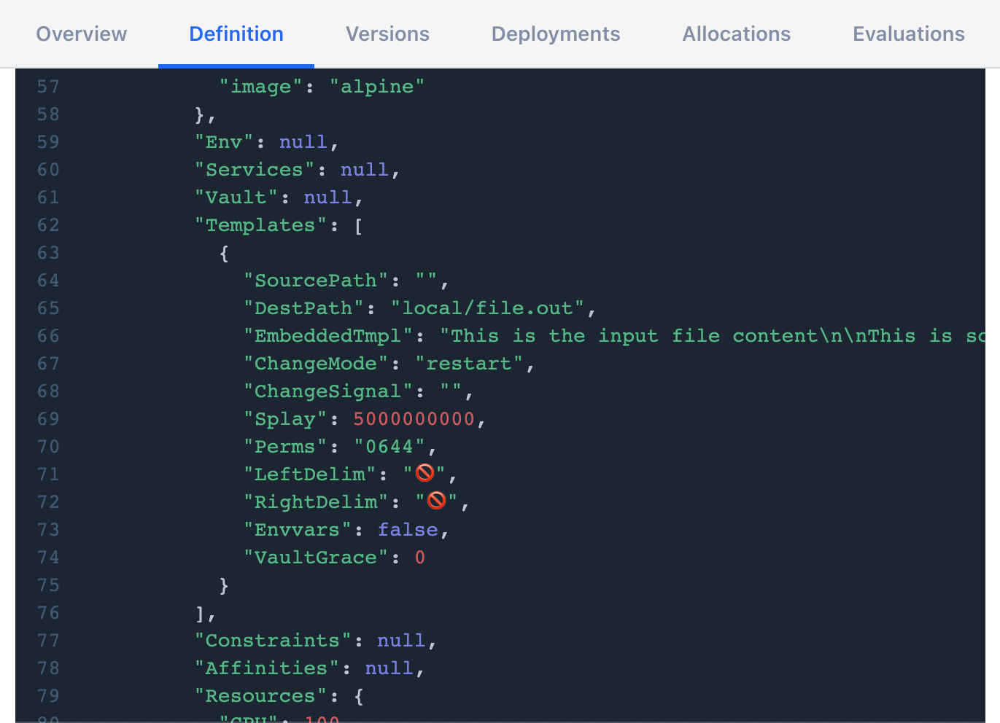

# Include a local file at job runtime

You can use the HCL2 file function and a runtime variable to include a file in
your Nomad jobs. **These files should be small because they are stored in the
Nomad server state until the job is eligible for garbage collection.**

## Techniques

### Use the HCL2 file() function

- [`use_file.nomad`] — demonstrates the file function. This allows you to include
a template to be rendered.

### Wrap included files

Nomad will inject the file content into the template stanza directly, and it
will be rendered by the client. You might want to prevent Nomad from seeing
the content as renderable. There are a few techniques that you can use for
this.

- [`raw_file_delims.nomad`] — Uses alternative delimiters for the template
  stanza. These delimiter characters must never appear in the included file
  content. You can use interesting characters like emoji as delimiters
  because of Golang's Unicode support.

- [`raw_file_json.nomad`] — JSON encodes the file and uses the Nomad template
  engine to decode it on the client. The input file must not contain the default
  template delimiters (`{{` and `}}`) or you must redefine them because they are
  not escaped.
  <details> <summary>You can even use emoji, depending on OS support.</summary>

  

  </details>

- [`raw_file_b64.nomad`] — demonstrates using base64 as a means to wrap your
  included file so that it's only unwrapped on the destination client.

## Explore

This directory contains a test file you can use named `input.file`, or you can
supply your own file to include.

### Run the job

The jobs all define an input variable named `input_file`. You must supply the
path to the file to include. You must provide it as an environment variable or
as a flag. 

#### Environment variable

```shell
export NOMAD_VAR_input_file=./input.file
nomad job run use_file.nomad
```

#### Flag

```shell
nomad job run -var "input_file=./input.file" use_file.nomad
```

### Inspect the job

Run the `nomad job inspect` command to see how the JSON job specification
represents the job. Some techniques present the contents in the clear and
some opaque the file contents completely.

```shell
nomad job inspect use_file.nomad
```

### Get the logs from the allocation

Get the allocation ID from the output of the `nomad job run` command and fetch
the logs.

```shell
nomad alloc logs «alloc_id»
```

### Stop the job

```shell
nomad job stop use_file.nomad
```

## About the job

The job contains one task. Nomad renders the `template` stanza's content—the
included file—into the task's `local` directory. It then starts an
`alpine:latest` container that runs `cat` on the rendered file and sleeps
until stopped.

[`use_file.nomad`]: ./use_file.nomad
[`raw_file_delims.nomad`]: ./raw_file_delims.nomad
[`raw_file_json.nomad`]: ./raw_file_json.nomad
[`raw_file_b64.nomad`]: ./raw_file_b64.nomad
