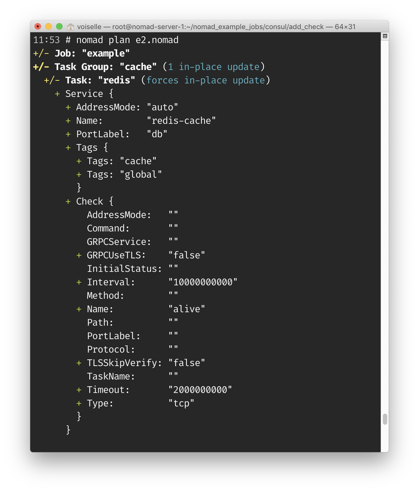
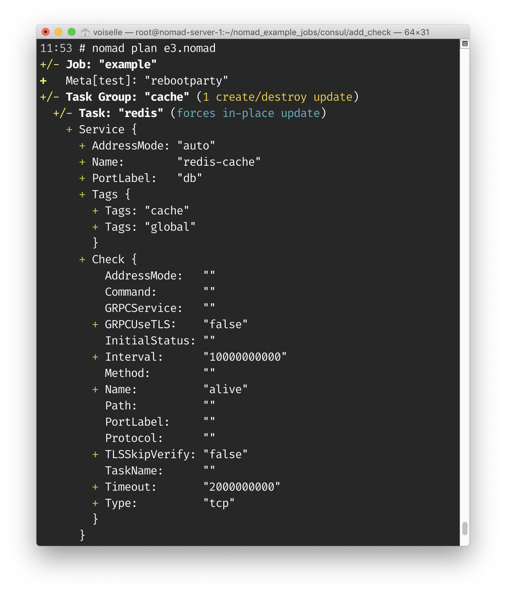

# Adding a service to a Nomad Job

This example shows a simple Nomad job (e1.nomad) which can be run in the cluster.  Running `e2.nomad` will add a consul check to the job. Adding a check is a non-destructive operation.

Running `e3.nomad` will cause a destructive change because it adds a job meta argument which must be dealt with by restarting the workload.  This counterexample helps to illustrate that adding a check is a non-destructive operation.

